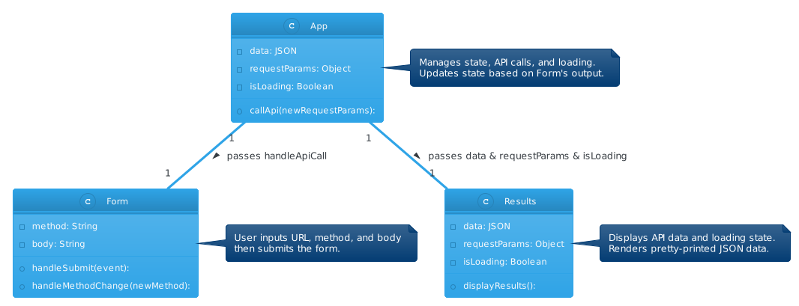

# LAB - Class 26

## Project: RESTy

### Author: Bryan O. Garduno Gonzalez

### **Problem Domain**

RESTy, now in its second phase, continues its evolution into a more dynamic and interactive React application. This phase focuses on enhancing user interaction and functionality:

- **Enhanced User Interaction**: RESTy now accepts user input for API URLs and REST methods, allowing dynamic API interaction.

- **Functional Component Transformation**: The conversion from class to functional components is extended to the `<App />`, leveraging the `useState` hook for state management.

- **Live API Integration Preparation**: The groundwork is laid for live API connections, simulating real-world application scenarios. 

- **Dynamic Data Presentation**: The `<Results />` component is now equipped to display API responses, including headers and formatted JSON, enhancing the data presentation.

- **Loading State Management**: Introduction of a loading state offers a more responsive user experience during API calls.

This phase marks a significant stride towards a fully functional API interaction tool, setting the stage for further advancements in the RESTy application.

### Links and Resources

- Main [SandBox Deployment](https://lj5mks-5173.csb.app/)

### Collaborators

- **ChatGPT by OpenAI**: Used as a programming partner for brainstorming ideas, debugging code, formulating tests, and drafting documentation.

### Setup

#### `.env` requirements (where applicable)

A .env file is included in local repository. A .env-sample file is uploaed to the remote repo so collaborators understand what environmental variables are being used.

#### How to initialize/run your application (where applicable)

- e.g. `npm start`

#### How to use your library (where applicable)

## Features

The RESTy application, now in its evolved phase, is a modern and dynamic tool for API interactions, built using React's functional components and advanced state management techniques. This brings significant improvements and new features:

1. **Functional Component Architecture**:

   - Transitioned to using React's functional components with `useState` for state management, enhancing code readability and maintainability.
   
   - The `<App />` component, along with others like `<Form />`, `<Results />`, `<Header />`, and `<Footer />`, are now functional components.
   
2. **Enhanced API Interaction**:

   - The `<Form />` component enables users to input and select REST methods (GET, POST, PUT, DELETE) and URLs, offering dynamic interaction with APIs.
   
   - Users can submit API requests and view real-time responses.
   
3. **Dynamic Results Display**:

   - The `<Results />` component displays API responses, including headers, method, URL, and results, in a user-friendly, pretty-printed JSON format.
   
   - It handles both the loading state and the display of fetched data, improving user interaction.
   
4. **Responsive and Interactive UI**:

   - Maintains the application's responsive design, ensuring a seamless experience across different devices.
   
   - The `<Header />` component features a responsive navigation bar with a mobile-friendly design.
   
   - The `<Footer />` component includes social media icons for enhanced user engagement.
   
5. **Comprehensive Testing**:

   - Implemented thorough testing for each component using Vitest and the React Testing Library ensuring robustness and reliability of the application.
   
These advancements position RESTy as an interactive and efficient tool for API exploration and testing, with a focus on modern React practices and user experience.

### Responsive Design

The RESTy application is designed with a focus on responsive design, ensuring a seamless user experience across various devices and screen sizes. This responsiveness is achieved through a combination of CSS grid layout and media queries, alongside dynamic component rendering in React. Here's how the application adapts to different devices:

1. **Grid-Based Layout**:

   - The `.app` class in `App.scss` uses a CSS grid layout to define the structure of the application.
   - The default grid template divides the page into three columns and three rows, assigning specific areas for the header, form, results, and footer.
   - This layout provides a clean and organized structure for larger screens.

2. **Media Queries for Mobile Responsiveness**:

   - A media query in `App.scss` targets screens with a maximum width of 768px, adjusting the grid layout to a single column format.
   - This change stacks the header, form, results, and footer vertically, optimizing the layout for mobile devices.

3. **Dynamic Navigation Bar**:

   - The `<Header />` component in `Header/index.jsx` utilizes React's `useState` to manage the navigation bar's state.
   - On smaller screens, a toggle icon (`HiMenuAlt4`) is displayed. When clicked, it expands into a full-screen navigation menu, providing easy access to links like "home", "history", and "help".
   - This dynamic behavior ensures the navigation bar remains functional and accessible on mobile devices.

4. **Adaptive Styling**:

   - In `Header.scss`, media queries control the visibility of the navigation links. The standard horizontal navigation bar is hidden on smaller screens, replaced by the mobile-friendly toggle menu.
   - Styling for the mobile menu (`nav__mobile`) is activated under 768px screen width, ensuring that the user interface remains intuitive and uncluttered.

5. **Enhanced User Experience**:
   - The application's responsive design not only adjusts to screen size changes but also maintains a consistent look and feel.
   - This design approach enhances the user experience, making it easy to navigate and interact with the application regardless of the device used.

By leveraging CSS grid, media queries, and React's state management, RESTy provides a robust and adaptable user interface, catering to the needs of users on both desktop and mobile platforms.

## Tests 

### Testing Setup and Implementation

In this update of RESTy, I introduced a robust testing environment to ensure the functionality and reliability of the application. Key aspects include:

- **Testing Framework**: Utilization of Vitest for effective React component and application logic testing.

- **Test Environment Configuration**: Adjustments in `vite.config.js` and `.eslintrc.cjs` to align with the React Testing Library.

- **Testing Scripts**: The `package.json` includes a test script for executing tests with coverage reporting.

- **React Testing Integration**: Empowers user-centric testing for React components. 

- **Global Test Setup**: Implemented in `tests/setup.js`, standardizing testing behaviors, including cleanup after each test.

### Component Testing

Detailed tests for each major component of RESTy have been implemented, as follows:

- **App Component**: Checks for proper rendering of the main app component.

- **Header Component**: Tests header, logo, navigation link rendering, and mobile menu functionality.

- **Form Component**: Validates form rendering, URL input changes, method selections, and textarea visibility for POST and PUT methods.

- **Results Component**: Assesses loading state, result text rendering, API data display, and "No Data" message for null data.

- **Footer Component**: Ensures rendering of the footer, title "RESTy", copyright information, and social media icon presence.

### Running the Tests

To run the tests, execute the `npm test` command.

### Incomplete or Skipped Tests  

At this stage, all essential component tests have been implemented. Any future tests or enhancements will be noted in subsequent updates or phases.

#### UML

;
