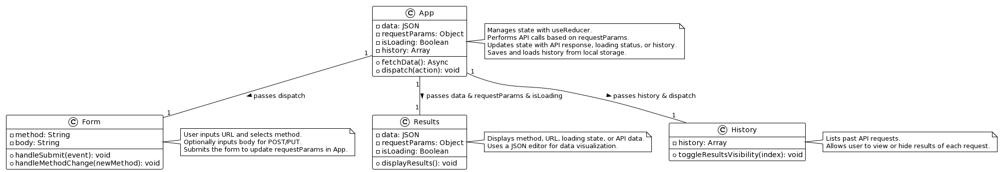

# LAB - Class 26

## Project: RESTy

### Author: Bryan O. Garduno Gonzalez

### Problem Domain

RESTy, now in phase three of development, has undergone a significant transformation, embracing the capability to connect to live APIs to fetch and display remote data. This phase concentrates on empowering users with the ability to see the history of API requests. This feature is set up using history state management as well as local storage.  

### Links and Resources

- Main [SandBox Deployment]()

### Collaborators

- **ChatGPT by OpenAI**: Used as a programming partner for brainstorming ideas, debugging code, formulating tests, and drafting documentation.

### Setup

#### `.env` requirements (where applicable)

A .env file is included in local repository. A .env-sample file is uploaed to the remote repo so collaborators understand what environmental variables are being used.

#### How to initialize/run your application (where applicable)

- e.g. `npm start`

#### How to use your library (where applicable)

## Features

In Phase 4, I've introduced significant enhancements to improve the state management and user experience. These updates focus on making the application more robust and user-friendly, particularly in managing API calls and their history. 

### State Management with `useReducer()`

The app has transitioned to using the `useReducer()` hook for state management within the `App` component.  This approach provides a more manageable and predictable state architecture, especially as the complexity of the application grows. The `useReducer()` hook allows us to centralize the state logic, making it easier to maintain and understand the flow of data and actions within the app.

### History State Management

A key feature of this phase is the introduction of a history state, which captures the details of each API call made by the user. This includes the HTTP method, the request URL, and the response data. The history feature enables users to view their past requests, fostering a more intuitive and efficient workflow, particularly for repetitive API testing and exploration.

### Integration with Local Storage

To enhance the persistency of the application's state, we've integrated local storage to save the history of API calls. This means that the user's history is preserved across browser sessions, allowing for immediate access to past requests upon returning to the application. The history state is automatically updated in local storage whenever a new API call is made, ensuring that the user's activity log is always up-to-date.

### React Router DOM  

The incorporation of `react-router-dom` brings in dynamic client-side routing, enabling RESTy to render different components based on the browser's URL. This is achieved without a full page reload, offering a fluid and app-like user experience. Key elements from `react-router-dom` used in RESTY include:  

- `createBrowserRouter`: Utilized to configure and create a new router instance. This function sets up the routes for the application, defining the paths and the corresponding component to render.  

- `RouterProvider`: Acts as the router context provider, wrapping the application's component tree. This allows any component within the tree to access routing functionality, such as navigation and route parameters.  
- `Outlet`: Serves as a placeholder component that renders the current route's child components. It's used within the layout component to dynamically display the content based on the current route.  

#### Layout Component  

The `Main.jsx` file defines a `layout` component that structures the application's main layout. This layout includes the header, sidebars, content area (where `Outlet` is placed to render routed components), and footer. This design ensures a consistent look and feel across different pages while allowing for dynamic content rendering based on the route.  

#### Query Client

RESTy employs `@tanstack/react-query` for efficient data fetching and state management for server state. The `QueryClient` instance encapsulates the configuration and state for queries and mutations, providing a powerful caching and synchronization mechanism.  

- `QueryClientProvider`: This component wraps the app's content area, making the `QueryClient` available throughout the component tree. This enables any child component to use hooks like `useQuery` for data fetching, benefiting from the automatic background updates and cache management.  

#### Navigation Components  

RESTy's navigation is enhanced with `Navbar` and `MobileNav` components, leveraging `Link` from `react-router-dom` for declarative, accessible navigation. These components utilize a list of navigation links, providing users with a seamless way to navigate between different sections of the application, such as Home, App, History, About, and Contact pages.  

- `Link`: Used within the navigation components to create accessible navigation items that update the browser's URL without a page reload, guiding users through the application's routes.  

### Updated Responsive Design  

Phase 3 of RESTy advances the user interface with a sophisticated responsive design and sets the stage for a dashboard-style layout on the Home page. This development enhances the application's adaptability across various devices, from desktops to smartphones, ensuring a seamless user experience.  

The `Header` component dynamically toggles between the `Navbar` for desktop and `MobileNav` for mobile devices, employing media queries to optimize display for all screen sizes. The `MobileNav` leverages the `Sheet` component from the `shadcn/ui` library to offer a modern, slide-out menu, enriching mobile navigation with an interactive element.  

On the Home page, a grid-based layout sets the foundation for a dashboard that will eventually display dynamic data, aligning with RESTy's core functionality of API interaction. This grid layout, designed with CSS grid and responsive media queries, adapts smoothly across different viewport sizes, transitioning from a multi-column arrangement on larger screens to a single-column format on smaller ones. Key grid items are designed to span multiple rows and columns, adding visual interest and flexibility to accommodate diverse content types.  

### Leveraging `useEffect()` for Dynamic Data Fetching  

In Phase 3, RESTy uses the `useEffect()` hook to enhance the data fetching capabilities, enabling dynamic API interactions based on the user input. This strategic implementation is pivotal for the real-time retrieval and display of API data, reflecting RESTy's evolution into a more interactive and responsive application.  

#### Dynamic API Calls  
The `App` component utilizes `useEffect()` to monitor changes to `requestParams`, a state that encapsulates the API request details input by the user through the `Form` component. Upon detecting changes, `useEffect()` triggers `fetchData`, an asynchronous function that constructs and executes the API call using the specified parameters, including the URL, HTTP method, and, when applicable, the request body.  

#### Responsive UI Updates  

To keep the user informed, RESTy introduces a loading state managed by `useState()`, which is toggled by `setIsLoading()` within `useEffect()`. This loading indicator provides immediate feedback upon initiating an API call, enhancing the user experience by signaling the application is processing their request.

## Tests 

### Testing Setup and Implementation

In this update of RESTy, I introduced a robust testing environment to ensure the functionality and reliability of the application. Key aspects include:

- **Testing Framework**: Utilization of Vitest for effective React component and application logic testing.

- **Test Environment Configuration**: Adjustments in `vite.config.js` and `.eslintrc.cjs` to align with the React Testing Library.

- **Testing Scripts**: The `package.json` includes a test script for executing tests with coverage reporting.

- **React Testing Integration**: Empowers user-centric testing for React components. 

- **Global Test Setup**: Implemented in `tests/setup.js`, standardizing testing behaviors, including cleanup after each test.

### Component Testing

Detailed tests for each major component of RESTy have been implemented, as follows:

- **Header Component**: Verifies the component's rendering, including the full navigation for larger screens and the mobile navigation for smaller screens, ensuring adaptive navigation layout based on screen size. 

- **Navbar Component**: Validates the rendering of Navbar, including the logo, all specified navigation links, and social media icons, ensuring comprehensive navigation and branding elements are displayed as intended. 

- **MobileNav Component**: Tests the visibility of the mobile navigation trigger and its functionality to reveal navigation content upon interaction, ensuring the mobile navigation's responsive and interactive features are operational.

- **Form Component**: Validates the form's functionality, including URL input handling, method selection responsiveness, and conditional rendering of the textarea for POST and PUT methods, ensuring user inputs are correctly captured and processed.

- **Results Component**: Confirms the rendering of loading states, the display of request parameters, the presentation of fetched data in a readable format, and the visibility of a "No Data" message when no data is available, ensuring comprehensive feedback based on the API response.

- **Sidebar Component**: Ensures the sidebar's visibility and verifies the presence of main, general, and maintenance sections along with their respective links, confirming the component's role in facilitating navigation within the application.

- **Footer Component**: Confirms the rendering of the footer and checks for the correct display of copyright information, ensuring the application's footer provides consistent and accurate attribution across all pages.

### Running the Tests

To run the tests, execute the `npm test` command.

### Incomplete or Skipped Tests  

At this stage, all essential component tests have been implemented. Any future tests or enhancements will be noted in subsequent updates or phases.

#### UML

;
