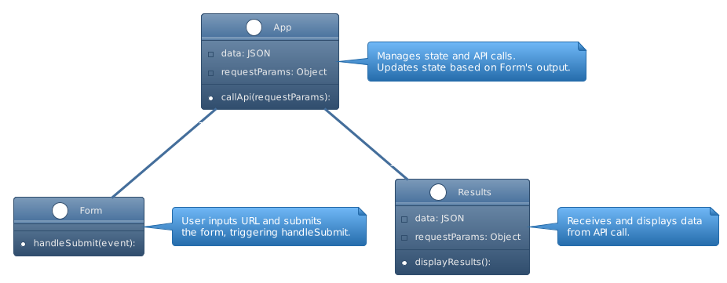

# LAB - Class 26

## Project: RESTy

### Author: Bryan O. Garduno Gonzalez

### Problem Domain

The RESTy application, a project designed in React, is entering its first phase of a four-phase development process. The primary objective in this initial phase is to establish the fundamental scaffolding of the application.

In its current state, RESTy is a proof of concept built using class components. The transition to production requires a significant refactor: converting these class components into React functional components. This transformation aims to establish a stable and high-performing foundation for the application.

**Key tasks in this phase include:**

- Refactoring all child components of the `<App />` from class to functional components. The `<App />` component itself, acting as the container for all sub-components, will remain as a class component.
- Ensuring that the base styles for `<App />` are incorporated within a `.scss` file imported in the App.jsx file.
- Utilizing ES6 import syntax to import the `<Header />`, `<Footer />`, `<Results />`, and `<Form />` components.
- Applying individual `.scss` files for styling each component, maintaining a clean and modular approach to styling.
- Preserving the core application functionality throughout this transition.

**Specific functional requirements for the components include:**

- The `<Form />` component should feature an `onSubmit()` function. This function is responsible for updating the `<App />` component with form values through a function passed down as a prop.
- The `<Results />` component should display mock API results, showcasing the application's ability to process and present data.

This phase is pivotal for setting a robust and efficient groundwork for RESTy, enabling smooth and scalable future enhancements.

### Links and Resources

- Main [SandBox Deployment](https://qf2rg6-5173.csb.app/)

### Collaborators

- **ChatGPT by OpenAI**: Used as a programming partner for brainstorming ideas, debugging code, formulating tests, and drafting documentation.

### Setup

#### `.env` requirements (where applicable)

A .env file is included in local repository. A .env-sample file is uploaed to the remote repo so collaborators understand what environmental variables are being used.

#### How to initialize/run your application (where applicable)

- e.g. `npm start`

#### How to use your library (where applicable)

## Features

The RESTy application, built using React, offers a suite of features designed to provide an intuitive and efficient user experience for interacting with APIs. Here's a breakdown of the key features based on the provided code:

1. **Dynamic API Interaction**:

   - The core functionality of RESTy revolves around interacting with APIs. Users can enter a URL to make API requests.
   - The `<Form />` component handles the submission of these requests. It defaults to the GET method, but the structure allows for expansion to other HTTP methods like POST, PUT, and DELETE.

2. **Real-time Results Display**:

   - The `<Results />` component dynamically displays the results of the API call.
   - It showcases both the method used and the URL of the API request, along with the JSON formatted response data.

3. **Responsive Navigation**:

   - The `<Header />` component includes a responsive navigation bar with links like "home", "history", and "help".
   - It features a mobile-friendly design with a toggle menu, enhancing usability on smaller screens.

4. **Scalable and Maintainable Code Structure**:

   - Components are organized in a modular fashion, each with its own styling file (`.scss`), promoting maintainability and scalability.
   - The use of ES6 import syntax and separation of concerns in components aligns with modern React best practices.

5. **Stylish and Functional UI**:

   - The application is styled using SCSS, offering a visually appealing interface.
   - Distinct components like `<Header />`, `<Form />`, `<Results />`, and `<Footer />` are styled individually, allowing for a cohesive yet flexible design approach.

6. **Social Media Integration**:

   - The `<Footer />` component includes social media icons like Facebook, Instagram, GitHub, and LinkedIn, facilitating user engagement and connectivity.

7. **Accessibility and User-Friendly Design**:
   - The application's layout and design are user-friendly, with clear labels and interactive elements like buttons and input fields.
   - Accessibility considerations can be observed in the clear labeling and structure of the components.

By focusing on these features, RESTy aims to provide a seamless and efficient experience for users to make and view API requests, with a clean, modern user interface and responsive design.

### Responsive Design

The RESTy application is designed with a focus on responsive design, ensuring a seamless user experience across various devices and screen sizes. This responsiveness is achieved through a combination of CSS grid layout and media queries, alongside dynamic component rendering in React. Here's how the application adapts to different devices:

1. **Grid-Based Layout**:

   - The `.app` class in `App.scss` uses a CSS grid layout to define the structure of the application.
   - The default grid template divides the page into three columns and three rows, assigning specific areas for the header, form, results, and footer.
   - This layout provides a clean and organized structure for larger screens.

2. **Media Queries for Mobile Responsiveness**:

   - A media query in `App.scss` targets screens with a maximum width of 768px, adjusting the grid layout to a single column format.
   - This change stacks the header, form, results, and footer vertically, optimizing the layout for mobile devices.

3. **Dynamic Navigation Bar**:

   - The `<Header />` component in `Header/index.jsx` utilizes React's `useState` to manage the navigation bar's state.
   - On smaller screens, a toggle icon (`HiMenuAlt4`) is displayed. When clicked, it expands into a full-screen navigation menu, providing easy access to links like "home", "history", and "help".
   - This dynamic behavior ensures the navigation bar remains functional and accessible on mobile devices.

4. **Adaptive Styling**:

   - In `Header.scss`, media queries control the visibility of the navigation links. The standard horizontal navigation bar is hidden on smaller screens, replaced by the mobile-friendly toggle menu.
   - Styling for the mobile menu (`nav__mobile`) is activated under 768px screen width, ensuring that the user interface remains intuitive and uncluttered.

5. **Enhanced User Experience**:
   - The application's responsive design not only adjusts to screen size changes but also maintains a consistent look and feel.
   - This design approach enhances the user experience, making it easy to navigate and interact with the application regardless of the device used.

By leveraging CSS grid, media queries, and React's state management, RESTy provides a robust and adaptable user interface, catering to the needs of users on both desktop and mobile platforms.

#### Tests

For this particular phase of the RESTy application development, testing is not a required component of the assignment. Therefore, no specific tests have been implemented or are necessary to run at this stage.

#### UML

;
